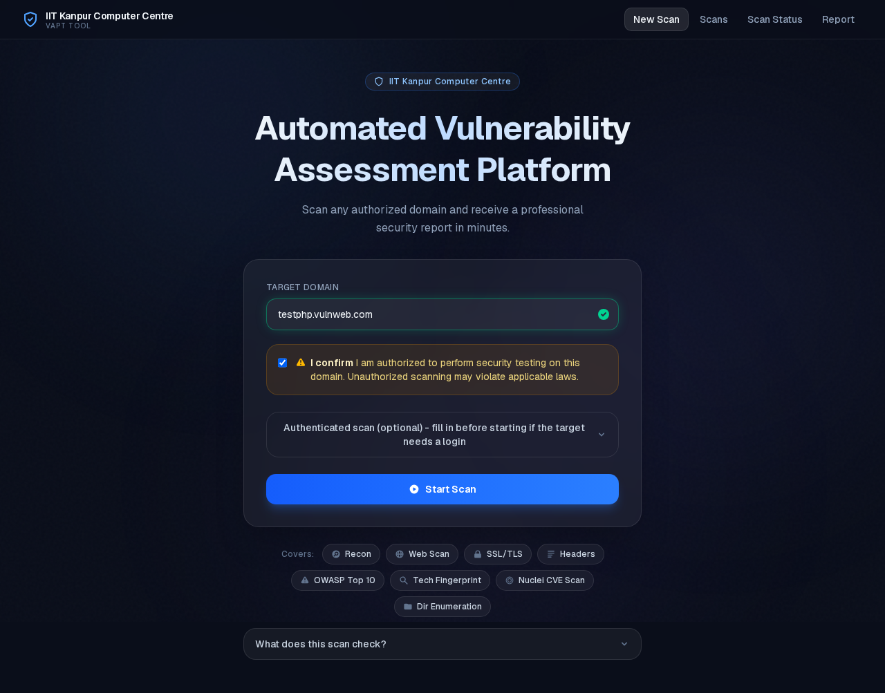
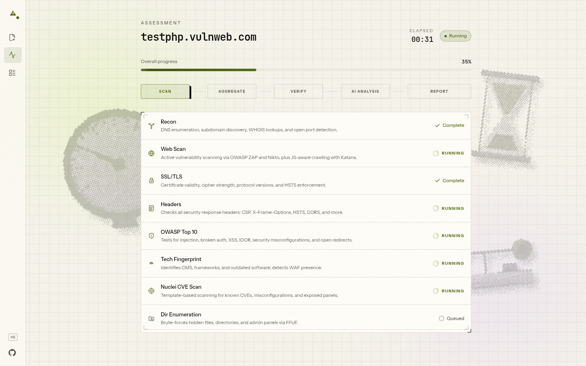
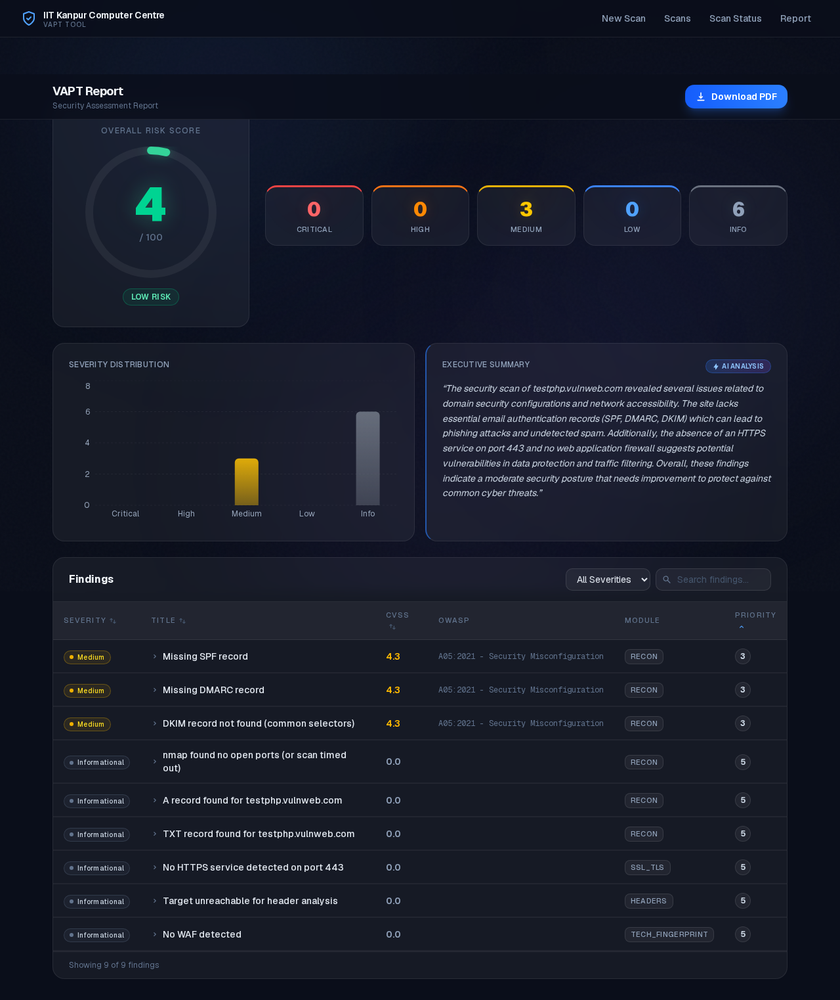
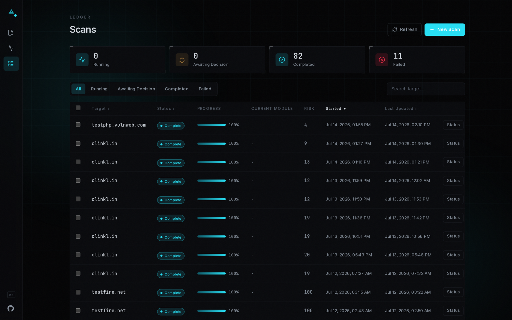
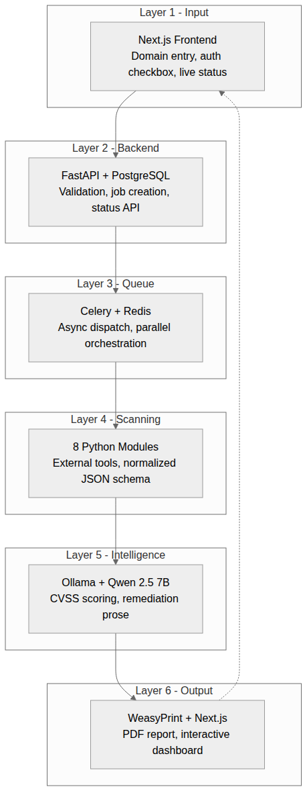

# VAPT Tool - Automated Vulnerability Assessment & Penetration Testing

[](LICENSE)
[](https://github.com/maverickaayush/Autonomous-AI-Powered-Vulnerability-Assessment-Platform/actions/workflows/ci.yml)

A locally-hosted, air-gapped VAPT tool: point it at an authorized target
domain and it runs 8 scanning modules in parallel, deterministically scores
every finding (CVSS v3.1), optionally adds AI-generated plain-English
descriptions via a local LLM, and produces a PDF report plus a live web
dashboard. No external API calls - everything runs on your own network.

## Features

- **8 parallel scanning modules** (Celery) - network recon
  (ports/services/subdomains/DNS/WHOIS), web app scanning (ZAP + Nikto +
  Katana), SSL/TLS config, HTTP security headers, OWASP Top 10 checks, tech
  fingerprinting/WAF detection, CVE scanning (Nuclei), directory enumeration
  (FFUF).
- **Deterministic CVSS v3.1 scoring** - severity, CVSS score/vector,
  priority, and OWASP category are computed from a rule catalogue, never
  guessed by an LLM. Two runs of the same scan produce byte-identical
  numeric fields.
- **Confidence verification** - findings are passively re-checked
  (non-destructive re-observation only) and tagged confirmed / probable /
  unverified rather than silently dropped.
- **Optional local AI analysis** - Ollama + Qwen 2.5 7B turns scored
  findings into plain-English descriptions and remediation steps. Fully
  air-gapped; the tool works without it (see Quick start below).
- **PDF report + web dashboard** - WeasyPrint-rendered report and a Next.js
  dashboard, both driven by the same scored/described findings.

## Screenshots

| New Scan | Live Scan Status |
|---|---|
|  |  |

| Report Dashboard | Scans Discovery |
|---|---|
|  |  |

## Architecture

```
domain → [recon | webscan | ssl_tls | headers | owasp | tech_fingerprint | nuclei | enumeration] (parallel, Celery)
       → any module failed/timed out? → pause for operator retry/continue/cancel
       → aggregator (dedup + OWASP-map + sort)
       → confidence verification (passive re-observation)
       → deterministic CVSS scoring
       → Ollama (Qwen 2.5 7B) AI analysis
       → WeasyPrint PDF + PostgreSQL
       → dashboard / PDF download
```



Six layers: Next.js frontend → FastAPI → Celery/Redis → 8 parallel scanning
modules → Ollama (Qwen 2.5 7B) → WeasyPrint PDF + dashboard. Full details in
[`the project docs`](the project docs) and [`docs/QUICK_REF.md`](docs/QUICK_REF.md).

## Prerequisites

- Docker + Docker Compose v2
- ~6GB free disk for the core image build (the backend image bundles Nuclei
  templates and a headless Chromium via Playwright, adding ~1.5GB on top of
  the base Python image)

## Quick start

```bash
cp .env.example .env
cp backend/subfinder-config/provider-config.yaml.example backend/subfinder-config/provider-config.yaml
docker compose up -d
docker compose ps        # wait for zap to report healthy (~2 min)
```

Open **http://localhost:3000**.

**This works with no Ollama install.** CVSS/severity/priority scoring is
always deterministic (`analysis/cvss_scorer.py`) - without Ollama running,
findings just get a rule-based description template instead of AI-generated
prose. See "Optional: enable AI-generated descriptions" below to turn that on.

**Zero API keys are required to run this tool.** Every scanning tool it
wraps (nmap, ZAP, Nikto, testssl.sh, Nuclei, Amass, Naabu, httpx, WhatWeb,
WAFW00F, FFUF) and Ollama itself work with no key at all. The subfinder
config copy step above is the one optional exception - leaving it as the
empty template is fine, subfinder just runs with free/public sources only.
To deepen subdomain enumeration, you can add up to two free-tier keys to
that file before starting: a GitHub personal access token and a
[ProjectDiscovery Chaos](https://chaos.projectdiscovery.io) API key - see
the comments inside `provider-config.yaml.example`.

## Optional: enable AI-generated descriptions

Ollama runs **natively on the host** (not in Docker) so it can use the
host's GPU directly; containers reach it via `host.docker.internal`.

1. Install Ollama on the host: https://ollama.com/install.sh
2. Pull the model: `ollama pull qwen2.5:7b`
3. **Make Ollama reachable from Docker containers** (Ollama defaults to
   `127.0.0.1`-only, which Docker's bridge network cannot reach):
   ```bash
   sudo systemctl edit ollama
   ```
   Add under `[Service]`:
   ```ini
   [Service]
   Environment="OLLAMA_HOST=0.0.0.0:11434"
   ```
   Save, then:
   ```bash
   sudo systemctl daemon-reload && sudo systemctl restart ollama
   ```
   Note: this makes Ollama reachable from your local network, not just
   Docker - fine on a personal machine, worth a firewall rule on a shared one.
4. Verify: `curl http://localhost:11434/api/tags`
5. Restart the backend/worker so they pick it up: `docker compose restart backend worker`

## Optional: practice targets

The compose file also defines 12 intentionally-vulnerable practice apps
(Juice Shop, DVWA, bWAPP, Mutillidae, NodeGoat, DVWP/WordPress behind a
ModSecurity WAF, Metasploitable2, WebGoat) for trying the scanner against
something without needing your own authorized target. They're gated behind
a Compose profile so they never build/start by default:

```bash
docker compose --profile targets up -d
```

Most of these run from prebuilt images and need nothing extra. Two -
`nodegoat` and `dvwp-wordpress` - build from source that isn't vendored into
this repo and must be cloned first:

```bash
git clone https://github.com/OWASP/NodeGoat nodegoat-src
git clone https://github.com/vavkamil/dvwp dvwp-src
```

Published ports once running: Juice Shop `:3001`, DVWA `:8081`, bWAPP
`:8083`, Mutillidae `:8084`, NodeGoat `:8085`, DVWP (via WAF, TLS) `:8444`,
WebGoat `:8082`. Metasploitable2 publishes no host port (reachable only from
`backend`/`worker` over Docker's internal network) since it exposes real
backdoored/unauthenticated network services.

## Configuration

Env vars, set via `.env` (copied from `.env.example`):

| Variable | Default | Purpose |
|---|---|---|
| `POSTGRES_PASSWORD` | `vapt_secure_2025` | Database password |
| `SECRET_KEY` | `change_me_to_a_long_random_string` | Backend secret key |
| `ALLOWED_HOSTS` | `localhost,127.0.0.1` | FastAPI allowed hosts |
| `OLLAMA_URL` | `http://host.docker.internal:11434` | Where the backend/worker reach Ollama |
| `SCAN_TIMEOUT_MULTIPLIER` | `1.5` | Scales every module's tool/Celery timeout - real-world targets are slower than lab targets; drop to `1.0` for lab-tuned timings |
| `MAX_CONCURRENT_SCANS` | `5` | Concurrent-scan cap (resource-exhaustion guard, also sizes the DB connection pool) |

## Stop

```bash
docker compose down
```

## Logs

```bash
docker compose logs -f backend worker
```

## Testing & Validation

```bash
pip install -r backend/requirements-dev.txt
pytest backend/tests
```

438 automated backend tests as of this writing. Beyond the unit/integration
suite, the tool has been exercised end-to-end during development: 79 real
scans executed and 124 PDF reports generated against nine deliberately-
vulnerable practice applications (DVWA, Juice Shop, Mutillidae, NodeGoat,
bWAPP, WebGoat, Metasploitable2, DVWP/WordPress behind a WAF) plus one
authorized public target (`testphp.vulnweb.com`) - not hypothetical numbers,
see the "Approved test targets" list in [`the project docs`](the project docs), Section 8,
for what's actually safe to point this at.

## Documentation

- [`the project docs`](the project docs) - full architecture, schemas, and the operational
  contract for this project. Read this before making a non-trivial change.
- [`docs/QUICK_REF.md`](docs/QUICK_REF.md) - run commands, folder
  responsibilities, "where do I make this change."
- [`docs/scanners.md`](docs/scanners.md) - reasoning behind each scanning
  module's timing/flag design.
- [`docs/ai.md`](docs/ai.md) - Ollama timeout/context tuning, why scoring
  moved off the LLM entirely.
- [`docs/docker.md`](docs/docker.md) - Docker deviation notes and build
  gotchas.
- [`docs/troubleshooting.md`](docs/troubleshooting.md) - how to manually
  test any module/stage in isolation.
- [`docs/roadmap.md`](docs/roadmap.md) - historical build sequence
  (build is complete).
- [`CONTRIBUTING.md`](CONTRIBUTING.md) - dev setup, tests, PR expectations.

## License

MIT - see [LICENSE](LICENSE).

## Authorized use only

Scanning targets without explicit written authorization is illegal under the
IT Act 2000 (India) and equivalent international statutes. This tool
requires authorization confirmation on every scan and logs the operator +
timestamp for accountability.
